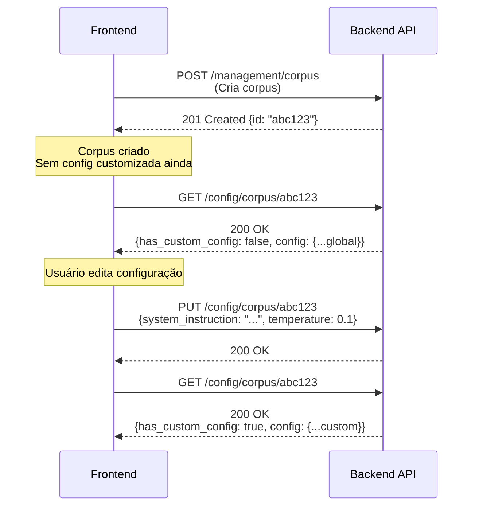

# API de Configuração Dinâmica por Corpus

**Documentação Técnica para Frontend Developers**

---

## 📋 Índice

1. [Visão Geral](#visão-geral)
2. [Conceitos Fundamentais](#conceitos-fundamentais)
3. [Endpoints da API](#endpoints-da-api)
4. [Schemas de Dados](#schemas-de-dados)
5. [Fluxos de Trabalho](#fluxos-de-trabalho)
6. [Códigos de Erro](#códigos-de-erro)
7. [Exemplos Práticos](#exemplos-práticos)

---

## Visão Geral

### O que é?

Sistema que permite **personalizar o comportamento do chat RAG por departamento/corpus**, incluindo:
- Personalização da persona do assistente
- Ajuste de parâmetros do modelo (temperatura, tokens, etc.)
- Configuração do RAG (quantos documentos usar)
- Parâmetros de performance (timeout, thinking budget)

### Por que usar?

- **Departamento Jurídico** precisa de respostas conservadoras e precisas (temperature=0.1)
- **Departamento RH** precisa de tons empáticos e equilibrados (temperature=0.4)
- **Departamento Técnico** precisa de mais contexto documental (RAG top_k=15)

---

## Conceitos Fundamentais

### Hierarquia de Configuração

```
┌─────────────────────────────────────┐
│   Global Config (global.json)      │  ← Defaults aplicados a todos
│   - Formatação fixa                │
│   - Regras de segurança            │
│   - Valores padrão                 │
└──────────────┬──────────────────────┘
               │ herda
               ↓
┌─────────────────────────────────────┐
│   Corpus Config (corpus/{id}.json) │  ← Sobrescreve valores específicos
│   - Persona customizada            │
│   - Temperature ajustada           │
│   - RAG top_k personalizado        │
└──────────────┬──────────────────────┘
               │ merge
               ↓
┌─────────────────────────────────────┐
│   Config Final Aplicada no Chat    │
└─────────────────────────────────────┘
```

### Lazy Loading

- **Ao criar corpus**: Nenhum arquivo de config é criado
- **Primeira customização**: Cria `config/corpus/{corpus_id}.json`
- **Uso sem customização**: Usa defaults globais automaticamente

### Campos Fixos vs Customizáveis

**Campos FIXOS** (global, não customizáveis):
- `formatting_rules` - Regras de formatação Markdown
- `grounding_rules` - Regras de uso do RAG
- `safety_settings` - Configurações de segurança

**Campos CUSTOMIZÁVEIS**:
- `system_instruction` - Persona do assistente
- `model_name` - Modelo LLM a usar
- `generation_config` - Parâmetros de geração
- `rag_retrieval_top_k` - Quantidade de contexto
- `timeout_seconds` - Timeout de requisição
- `thinking_budget` - Budget de raciocínio
- `max_history_length` - Tamanho do histórico

---

## Endpoints da API

### Base URL

```
https://seu-dominio.com/api/v1
```

Prefixo: `/config`

---

### 1. GET /config/global

**Descrição**: Obtém a configuração global (defaults e regras fixas)

#### Request

```http
GET /api/v1/config/global
Authorization: Bearer {jwt_token}
```

**Headers Obrigatórios**:
- `Authorization`: Bearer token JWT

**Query Parameters**: Nenhum

#### Response (200 OK)

```json
{
  "defaults": {
    "model_name": "gemini-2.5-pro",
    "generation_config": {
      "temperature": 0.2,
      "top_p": 0.8,
      "top_k": 40,
      "max_output_tokens": 16384
    },
    "rag_retrieval_top_k": 10,
    "timeout_seconds": 90.0,
    "thinking_budget": 1024,
    "max_history_length": 20,
    "default_persona": "# PERSONA\nVocê é um assistente virtual..."
  },
  "formatting_rules": "# FORMATAÇÃO DE RESPOSTA\n- Use SEMPRE sintaxe Markdown...",
  "grounding_rules": "# REGRAS DE GROUNDING (CRÍTICO)\n1. Você tem acesso..."
}
```

**Response Schema**:

| Campo                          | Tipo    | Descrição                                  |
| ------------------------------ | ------- | ------------------------------------------ |
| `defaults`                     | object  | Valores padrão aplicados a todos os corpus |
| `defaults.model_name`          | string  | Modelo LLM padrão                          |
| `defaults.generation_config`   | object  | Configurações de geração padrão            |
| `defaults.rag_retrieval_top_k` | integer | Quantidade de chunks RAG (default)         |
| `defaults.timeout_seconds`     | float   | Timeout padrão em segundos                 |
| `defaults.thinking_budget`     | integer | Tokens de raciocínio (gemini-2.5-pro)      |
| `defaults.max_history_length`  | integer | Máximo de mensagens no histórico           |
| `formatting_rules`             | string  | Regras fixas de formatação (não editáveis) |
| `grounding_rules`              | string  | Regras fixas de RAG (não editáveis)        |

#### Códigos de Erro

| Código                      | Descrição                     |
| --------------------------- | ----------------------------- |
| `401 Unauthorized`          | Token JWT ausente ou inválido |
| `403 Forbidden`             | Token expirado                |
| `500 Internal Server Error` | Erro ao ler global.json       |

#### Exemplo Frontend (JavaScript)

```javascript
async function getGlobalConfig() {
  const response = await fetch('https://api.example.com/api/v1/config/global', {
    headers: {
      'Authorization': `Bearer ${jwtToken}`
    }
  });
  
  if (!response.ok) {
    throw new Error(`HTTP ${response.status}: ${response.statusText}`);
  }
  
  const config = await response.json();
  return config;
}
```

---

### 2. GET /config/corpus/{corpus_id}

**Descrição**: Obtém a configuração FINAL de um corpus (global + customizações)

#### Request

```http
GET /api/v1/config/corpus/{corpus_id}
Authorization: Bearer {jwt_token}
```

**Path Parameters**:

| Parâmetro   | Tipo   | Obrigatório | Descrição                         |
| ----------- | ------ | ----------- | --------------------------------- |
| `corpus_id` | string | ✅ Sim       | ID do corpus (ex: "244320279784") |

**Headers Obrigatórios**:
- `Authorization`: Bearer token JWT

#### Response (200 OK)

```json
{
  "corpus_id": "244320279784",
  "config": {
    "model_name": "gemini-2.5-pro",
    "system_instruction": "Você é o assistente jurídico do CREA-GO...",
    "generation_config": {
      "temperature": 0.1,
      "top_p": 0.8,
      "top_k": 40,
      "max_output_tokens": 8192
    },
    "rag_retrieval_top_k": 15,
    "timeout_seconds": 120.0,
    "thinking_budget": 2048,
    "max_history_length": 20,
    "formatting_rules": "...",
    "grounding_rules": "...",
    "safety_settings": {...}
  },
  "has_custom_config": true
}
```

**Response Schema**:

| Campo                        | Tipo    | Descrição                                                   |
| ---------------------------- | ------- | ----------------------------------------------------------- |
| `corpus_id`                  | string  | ID do corpus                                                |
| `config`                     | object  | **Configuração FINAL** (merge de global + corpus)           |
| `config.model_name`          | string  | Modelo LLM que será usado                                   |
| `config.system_instruction`  | string  | Persona completa (com formatação e grounding)               |
| `config.generation_config`   | object  | Parâmetros de geração aplicados                             |
| `config.rag_retrieval_top_k` | integer | Quantidade de chunks RAG                                    |
| `config.timeout_seconds`     | float   | Timeout da requisição                                       |
| `config.thinking_budget`     | integer | Budget de raciocínio (tokens)                               |
| `config.max_history_length`  | integer | Máximo de msgs no histórico                                 |
| `config.formatting_rules`    | string  | Regras fixas (sempre do global)                             |
| `config.grounding_rules`     | string  | Regras fixas (sempre do global)                             |
| `config.safety_settings`     | object  | Configurações de segurança fixas                            |
| `has_custom_config`          | boolean | `true` se corpus tem customização, `false` se usa só global |

#### Códigos de Erro

| Código                      | Descrição                                                              |
| --------------------------- | ---------------------------------------------------------------------- |
| `401 Unauthorized`          | Token JWT ausente ou inválido                                          |
| `403 Forbidden`             | Token expirado                                                         |
| `404 Not Found`             | ⚠️ **NÃO** retorna 404 - sempre retorna global se corpus não tem config |
| `500 Internal Server Error` | Erro ao processar configuração                                         |

#### Exemplo Frontend (JavaScript)

```javascript
async function getCorpusConfig(corpusId) {
  const response = await fetch(
    `https://api.example.com/api/v1/config/corpus/${corpusId}`,
    {
      headers: {
        'Authorization': `Bearer ${jwtToken}`
      }
    }
  );
  
  if (!response.ok) {
    throw new Error(`HTTP ${response.status}`);
  }
  
  const data = await response.json();
  
  // Verificar se tem customização
  if (data.has_custom_config) {
    console.log('Corpus tem configuração personalizada');
  } else {
    console.log('Corpus usa configuração global');
  }
  
  return data.config;
}
```

---

### 3. PUT /config/corpus/{corpus_id}

**Descrição**: Cria ou atualiza a configuração customizada de um corpus

#### Request

```http
PUT /api/v1/config/corpus/{corpus_id}
Authorization: Bearer {jwt_token}
Content-Type: application/json

{
  "system_instruction": "Você é o assistente jurídico...",
  "generation_config": {
    "temperature": 0.1,
    "max_output_tokens": 8192,
    "configuracao_extra": {
      "frequency_penalty": 0.5
    }
  },
  "rag_retrieval_top_k": 15,
  "timeout_seconds": 120.0,
  "thinking_budget": 2048
}
```

**Path Parameters**:

| Parâmetro   | Tipo   | Obrigatório | Descrição                 |
| ----------- | ------ | ----------- | ------------------------- |
| `corpus_id` | string | ✅ Sim       | ID do corpus a customizar |

**Headers Obrigatórios**:
- `Authorization`: Bearer token JWT
- `Content-Type`: application/json

**Request Body Schema**:

| Campo                                  | Tipo    | Obrigatório | Validação        | Descrição                         |
| -------------------------------------- | ------- | ----------- | ---------------- | --------------------------------- |
| `system_instruction`                   | string  | ❌ Opcional  | max 10.000 chars | Persona customizada do assistente |
| `model_name`                           | string  | ❌ Opcional  | -                | Modelo LLM (ex: "gemini-2.5-pro") |
| `generation_config`                    | object  | ❌ Opcional  | -                | Parâmetros de geração             |
| `generation_config.temperature`        | float   | ❌ Opcional  | 0.0 - 2.0        | Aleatoriedade (0=determinístico)  |
| `generation_config.top_p`              | float   | ❌ Opcional  | 0.0 - 1.0        | Nucleus sampling                  |
| `generation_config.top_k`              | integer | ❌ Opcional  | 1 - 100          | Top-K sampling                    |
| `generation_config.max_output_tokens`  | integer | ❌ Opcional  | 128 - 32768      | Máximo de tokens na resposta      |
| `generation_config.configuracao_extra` | object  | ❌ Opcional  | -                | Parâmetros futuros (pass-through) |
| `rag_retrieval_top_k`                  | integer | ❌ Opcional  | 1 - 50           | Quantidade de chunks RAG          |
| `timeout_seconds`                      | float   | ❌ Opcional  | 10.0 - 300.0     | Timeout da requisição             |
| `thinking_budget`                      | integer | ❌ Opcional  | 128 - 4096       | Budget de raciocínio (tokens)     |
| `max_history_length`                   | integer | ❌ Opcional  | 1 - 100          | Máximo de mensagens no histórico  |

**⚠️ IMPORTANTE**: 
- Todos os campos são **OPCIONAIS**
- Se não informado, usa valor global
- Você pode enviar apenas os campos que quer customizar

#### Response (200 OK)

```json
{
  "message": "Configuration updated successfully",
  "corpus_id": "244320279784"
}
```

**Response Schema**:

| Campo       | Tipo   | Descrição               |
| ----------- | ------ | ----------------------- |
| `message`   | string | Mensagem de sucesso     |
| `corpus_id` | string | ID do corpus atualizado |

#### Códigos de Erro

| Código                      | Descrição                     | Possível Causa                                                                                             |
| --------------------------- | ----------------------------- | ---------------------------------------------------------------------------------------------------------- |
| `400 Bad Request`           | Dados inválidos               | - Temperature fora do range (0.0-2.0)<br>- system_instruction > 10k chars<br>- top_k fora do range (1-100) |
| `401 Unauthorized`          | Token JWT ausente ou inválido | Header Authorization não enviado                                                                           |
| `403 Forbidden`             | Token expirado                | Token JWT expirado                                                                                         |
| `422 Unprocessable Entity`  | Validação Pydantic falhou     | Campo com tipo errado (ex: string no lugar de number)                                                      |
| `500 Internal Server Error` | Erro ao salvar arquivo        | Problema ao escrever JSON no servidor                                                                      |

#### Exemplo Frontend (JavaScript)

```javascript
async function updateCorpusConfig(corpusId, customConfig) {
  const response = await fetch(
    `https://api.example.com/api/v1/config/corpus/${corpusId}`,
    {
      method: 'PUT',
      headers: {
        'Authorization': `Bearer ${jwtToken}`,
        'Content-Type': 'application/json'
      },
      body: JSON.stringify(customConfig)
    }
  );
  
  if (!response.ok) {
    const error = await response.json();
    throw new Error(`Erro ${response.status}: ${error.detail}`);
  }
  
  return await response.json();
}

// Exemplo de uso: Customizar para Jurídico
await updateCorpusConfig('244320279784', {
  system_instruction: 'Você é o assistente jurídico. Seja preciso e técnico.',
  generation_config: {
    temperature: 0.1,
    max_output_tokens: 8192
  },
  rag_retrieval_top_k: 15,
  thinking_budget: 2048
});
```

#### Exemplo Frontend (React Component)

```jsx
function ConfigEditor({ corpusId }) {
  const [config, setConfig] = useState({
    temperature: 0.2,
    max_output_tokens: 16384,
    rag_retrieval_top_k: 10
  });

  const handleSave = async () => {
    try {
      await updateCorpusConfig(corpusId, {
        generation_config: {
          temperature: config.temperature,
          max_output_tokens: config.max_output_tokens
        },
        rag_retrieval_top_k: config.rag_retrieval_top_k
      });
      alert('Configuração salva com sucesso!');
    } catch (error) {
      alert(`Erro: ${error.message}`);
    }
  };

  return (
    <div>
      <label>
        Temperature (0.0 - 2.0):
        <input
          type="range"
          min="0"
          max="2"
          step="0.1"
          value={config.temperature}
          onChange={(e) => setConfig({
            ...config,
            temperature: parseFloat(e.target.value)
          })}
        />
        <span>{config.temperature}</span>
      </label>
      
      <button onClick={handleSave}>Salvar</button>
    </div>
  );
}
```

---

### 4. DELETE /config/corpus/{corpus_id}

**Descrição**: Remove a configuração customizada do corpus (volta a usar global)

#### Request

```http
DELETE /api/v1/config/corpus/{corpus_id}
Authorization: Bearer {jwt_token}
```

**Path Parameters**:

| Parâmetro   | Tipo   | Obrigatório | Descrição    |
| ----------- | ------ | ----------- | ------------ |
| `corpus_id` | string | ✅ Sim       | ID do corpus |

**Headers Obrigatórios**:
- `Authorization`: Bearer token JWT

**Request Body**: Nenhum

#### Response (200 OK)

```json
{
  "message": "Configuration deleted successfully",
  "corpus_id": "244320279784"
}
```

**Response Schema**:

| Campo       | Tipo   | Descrição           |
| ----------- | ------ | ------------------- |
| `message`   | string | Mensagem de sucesso |
| `corpus_id` | string | ID do corpus        |

#### Códigos de Erro

| Código                      | Descrição                                            |
| --------------------------- | ---------------------------------------------------- |
| `401 Unauthorized`          | Token JWT ausente ou inválido                        |
| `403 Forbidden`             | Token expirado                                       |
| `404 Not Found`             | Corpus não tem configuração customizada para deletar |
| `500 Internal Server Error` | Erro ao deletar arquivo                              |

#### Exemplo Frontend (JavaScript)

```javascript
async function resetCorpusConfig(corpusId) {
  const response = await fetch(
    `https://api.example.com/api/v1/config/corpus/${corpusId}`,
    {
      method: 'DELETE',
      headers: {
        'Authorization': `Bearer ${jwtToken}`
      }
    }
  );
  
  if (response.status === 404) {
    console.log('Corpus já usa configuração global (nada para deletar)');
    return;
  }
  
  if (!response.ok) {
    throw new Error(`HTTP ${response.status}`);
  }
  
  console.log('Configuração resetada para global');
}
```

---

## Schemas de Dados

### GenerationConfig

Configuração de parâmetros de geração do modelo LLM.

```typescript
interface GenerationConfig {
  temperature?: number;         // 0.0 - 2.0 (opcional)
  top_p?: number;              // 0.0 - 1.0 (opcional)
  top_k?: number;              // 1 - 100 (opcional)
  max_output_tokens?: number;  // 128 - 32768 (opcional)
  configuracao_extra?: {       // (opcional)
    [key: string]: any;        // Parâmetros futuros
  };
}
```

**Descrição dos Campos**:

| Campo                | Descrição                                                                                                                          | Recomendação                               |
| -------------------- | ---------------------------------------------------------------------------------------------------------------------------------- | ------------------------------------------ |
| `temperature`        | Controla aleatoriedade<br>- 0.0 = Determinístico, sempre mesma resposta<br>- 1.0 = Equilibrado<br>- 2.0 = Muito criativo/aleatório | Jurídico: 0.1<br>RH: 0.4<br>Marketing: 0.7 |
| `top_p`              | Nucleus sampling (corte cumulativo de probabilidade)                                                                               | Padrão: 0.8 (raramente precisa mudar)      |
| `top_k`              | Top-K sampling (considera apenas K tokens mais prováveis)                                                                          | Padrão: 40 (raramente precisa mudar)       |
| `max_output_tokens`  | Máximo de tokens na resposta                                                                                                       | Curta: 1024<br>Média: 4096<br>Longa: 16384 |
| `configuracao_extra` | Aceita novos parâmetros do Google sem atualizar API                                                                                | Usar para parâmetros experimentais         |

### CorpusConfigUpdate (Request Body)

Schema completo para `PUT /config/corpus/{id}`

```typescript
interface CorpusConfigUpdate {
  system_instruction?: string;           // max 10.000 chars
  model_name?: string;                   // ex: "gemini-2.5-pro"
  generation_config?: GenerationConfig;  // parâmetros de geração
  rag_retrieval_top_k?: number;         // 1 - 50
  timeout_seconds?: number;              // 10.0 - 300.0
  thinking_budget?: number;              // 128 - 4096
  max_history_length?: number;          // 1 - 100
}
```

### CorpusConfigResponse (GET Response)

Schema completo do response de `GET /config/corpus/{id}`

```typescript
interface CorpusConfigResponse {
  corpus_id: string;
  config: {
    model_name: string;
    system_instruction: string;
    generation_config: {
      temperature: number;
      top_p: number;
      top_k: number;
      max_output_tokens: number;
      configuracao_extra?: {
        [key: string]: any;
      };
    };
    rag_retrieval_top_k: number;
    timeout_seconds: number;
    thinking_budget: number;
    max_history_length: number;
    formatting_rules: string;    // sempre do global
    grounding_rules: string;     // sempre do global
    safety_settings: object;     // sempre do global
  };
  has_custom_config: boolean;
}
```

---

## Fluxos de Trabalho

### Fluxo 1: Primeira Configuração de um Corpus



**Código Frontend**:

```javascript
// 1. Criar corpus
const corpusResponse = await createCorpus({
  department_name: "Jurídico",
  description: "Departamento Jurídico"
});
const corpusId = corpusResponse.id;

// 2. Verificar config atual (ainda global)
const currentConfig = await getCorpusConfig(corpusId);
console.log(currentConfig.has_custom_config); // false

// 3. Customizar
await updateCorpusConfig(corpusId, {
  system_instruction: "Você é o assistente jurídico...",
  generation_config: {
    temperature: 0.1,
    max_output_tokens: 8192
  },
  rag_retrieval_top_k: 15
});

// 4. Verificar novamente (agora customizado)
const updatedConfig = await getCorpusConfig(corpusId);
console.log(updatedConfig.has_custom_config); // true
```

---

### Fluxo 2: Editar Configuração Existente

```javascript
// 1. Buscar config atual
const config = await getCorpusConfig(corpusId);

// 2. Modificar apenas temperature
const newTemperature = 0.3;

await updateCorpusConfig(corpusId, {
  generation_config: {
    temperature: newTemperature
  }
  // Outros campos mantêm valores anteriores
});
```

**⚠️ IMPORTANTE**: O PUT faz **merge inteligente**:
- Se você enviar apenas `temperature`, outros campos de `generation_config` mantêm valores anteriores
- Se você enviar `generation_config` completo, sobrescreve tudo

---

### Fluxo 3: Resetar para Global

```javascript
// Deletar customização
await resetCorpusConfig(corpusId);

// Verificar que voltou ao global
const config = await getCorpusConfig(corpusId);
console.log(config.has_custom_config); // false
console.log(config.config.generation_config.temperature); // 0.2 (global default)
```

---

### Fluxo 4: Deletar Corpus (Auto-delete Config)

```javascript
// Ao deletar corpus, config é deletada automaticamente
await deleteCorpus(corpusId);

// Não precisa chamar DELETE /config/corpus/{id}
// O backend faz isso automaticamente (previne órfãos)
```

---

## Códigos de Erro

### Matriz Completa de Erros

| Endpoint | Código | Causa                  | Ação Frontend                                 |
| -------- | ------ | ---------------------- | --------------------------------------------- |
| Todos    | 401    | Token ausente/inválido | Redirecionar para login                       |
| Todos    | 403    | Token expirado         | Refresh token ou logout                       |
| PUT      | 400    | Dados inválidos        | Mostrar mensagem de validação ao usuário      |
| PUT      | 422    | Tipo de campo errado   | Validar tipos antes de enviar                 |
| DELETE   | 404    | Config não existe      | Informar que já usa global (não é erro fatal) |
| Todos    | 500    | Erro no servidor       | Mostrar mensagem genérica + retry             |

### Exemplos de Erros 400 (Bad Request)

#### Temperature fora do range

**Request**:
```json
{
  "generation_config": {
    "temperature": 3.0  // ❌ Máximo é 2.0
  }
}
```

**Response** (400):
```json
{
  "detail": [
    {
      "loc": ["body", "generation_config", "temperature"],
      "msg": "ensure this value is less than or equal to 2.0",
      "type": "value_error.number.not_le"
    }
  ]
}
```

#### System instruction muito longa

**Request**:
```json
{
  "system_instruction": "a".repeat(10001)  // ❌ Máximo 10k chars
}
```

**Response** (400):
```json
{
  "detail": [
    {
      "loc": ["body", "system_instruction"],
      "msg": "ensure this value has at most 10000 characters",
      "type": "value_error.any_str.max_length"
    }
  ]
}
```

### Tratamento de Erros Frontend

```javascript
async function safeUpdateConfig(corpusId, config) {
  try {
    await updateCorpusConfig(corpusId, config);
    return { success: true };
  } catch (error) {
    if (error.status === 400 || error.status === 422) {
      // Validação falhou
      return {
        success: false,
        message: 'Dados inválidos. Verifique os valores.',
        details: error.body.detail
      };
    } else if (error.status === 401 || error.status === 403) {
      // Autenticação falhou
      redirectToLogin();
    } else {
      // Erro genérico
      return {
        success: false,
        message: 'Erro ao salvar. Tente novamente.'
      };
    }
  }
}
```

---

## Exemplos Práticos

### Exemplo 1: Interface de Configuração Simples

```jsx
function SimpleConfigEditor({ corpusId }) {
  const [temperature, setTemperature] = useState(0.2);
  const [saving, setSaving] = useState(false);
  
  useEffect(() => {
    // Carregar config atual
    getCorpusConfig(corpusId).then(data => {
      setTemperature(data.config.generation_config.temperature);
    });
  }, [corpusId]);
  
  const handleSave = async () => {
    setSaving(true);
    try {
      await updateCorpusConfig(corpusId, {
        generation_config: {
          temperature: temperature
        }
      });
      alert('✅ Configuração salva!');
    } catch (error) {
      alert(`❌ Erro: ${error.message}`);
    } finally {
      setSaving(false);
    }
  };
  
  return (
    <div>
      <h3>Ajustar Criatividade</h3>
      <input
        type="range"
        min="0"
        max="2"
        step="0.1"
        value={temperature}
        onChange={(e) => setTemperature(parseFloat(e.target.value))}
        disabled={saving}
      />
      <span>{temperature.toFixed(1)}</span>
      <button onClick={handleSave} disabled={saving}>
        {saving ? 'Salvando...' : 'Salvar'}
      </button>
    </div>
  );
}
```

---

### Exemplo 2: Interface Completa com Presets

```jsx
function AdvancedConfigEditor({ corpusId }) {
  const [config, setConfig] = useState(null);
  const [loading, setLoading] = useState(true);
  
  const presets = {
    conservative: {
      name: 'Conservador (Jurídico)',
      config: {
        system_instruction: 'Você é um assistente jurídico preciso e técnico.',
        generation_config: {
          temperature: 0.1,
          max_output_tokens: 8192
        },
        rag_retrieval_top_k: 15,
        thinking_budget: 2048
      }
    },
    balanced: {
      name: 'Equilibrado (RH)',
      config: {
        system_instruction: 'Você é um assistente de RH empático e prestativo.',
        generation_config: {
          temperature: 0.4,
          max_output_tokens: 4096
        },
        rag_retrieval_top_k: 10
      }
    },
    creative: {
      name: 'Criativo (Marketing)',
      config: {
        system_instruction: 'Você é um assistente criativo de marketing.',
        generation_config: {
          temperature: 0.7,
          max_output_tokens: 16384
        }
      }
    }
  };
  
  useEffect(() => {
    loadConfig();
  }, [corpusId]);
  
  const loadConfig = async () => {
    setLoading(true);
    const data = await getCorpusConfig(corpusId);
    setConfig(data.config);
    setLoading(false);
  };
  
  const applyPreset = async (presetKey) => {
    if (!confirm(`Aplicar preset "${presets[presetKey].name}"?`)) {
      return;
    }
    
    try {
      await updateCorpusConfig(corpusId, presets[presetKey].config);
      await loadConfig();
      alert('✅ Preset aplicado!');
    } catch (error) {
      alert(`❌ Erro: ${error.message}`);
    }
  };
  
  const resetToGlobal = async () => {
    if (!confirm('Resetar para configuração global?')) {
      return;
    }
    
    try {
      await resetCorpusConfig(corpusId);
      await loadConfig();
      alert('✅ Resetado para global!');
    } catch (error) {
      // 404 é esperado se já usa global
      if (error.status === 404) {
        alert('ℹ️ Já usa configuração global');
      } else {
        alert(`❌ Erro: ${error.message}`);
      }
    }
  };
  
  if (loading) return <div>Carregando...</div>;
  
  return (
    <div>
      <h2>Configuração do Corpus</h2>
      
      <section>
        <h3>Presets Rápidos</h3>
        {Object.entries(presets).map(([key, preset]) => (
          <button key={key} onClick={() => applyPreset(key)}>
            {preset.name}
          </button>
        ))}
      </section>
      
      <section>
        <h3>Configuração Atual</h3>
        <ul>
          <li>Temperature: {config.generation_config.temperature}</li>
          <li>Max Tokens: {config.generation_config.max_output_tokens}</li>
          <li>RAG Top-K: {config.rag_retrieval_top_k}</li>
          <li>Timeout: {config.timeout_seconds}s</li>
        </ul>
      </section>
      
      <button onClick={resetToGlobal}>
        🔄 Resetar para Global
      </button>
    </div>
  );
}
```

---

### Exemplo 3: Validação Client-Side

```javascript
function validateConfig(config) {
  const errors = [];
  
  if (config.system_instruction) {
    if (config.system_instruction.length > 10000) {
      errors.push('System instruction muito longa (máx 10.000 chars)');
    }
  }
  
  if (config.generation_config) {
    const gc = config.generation_config;
    
    if (gc.temperature !== undefined) {
      if (gc.temperature < 0 || gc.temperature > 2) {
        errors.push('Temperature deve estar entre 0.0 e 2.0');
      }
    }
    
    if (gc.top_p !== undefined) {
      if (gc.top_p < 0 || gc.top_p > 1) {
        errors.push('Top-P deve estar entre 0.0 e 1.0');
      }
    }
    
    if (gc.max_output_tokens !== undefined) {
      if (gc.max_output_tokens < 128 || gc.max_output_tokens > 32768) {
        errors.push('Max output tokens deve estar entre 128 e 32.768');
      }
    }
  }
  
  if (config.rag_retrieval_top_k !== undefined) {
    if (config.rag_retrieval_top_k < 1 || config.rag_retrieval_top_k > 50) {
      errors.push('RAG top-K deve estar entre 1 e 50');
    }
  }
  
  if (config.timeout_seconds !== undefined) {
    if (config.timeout_seconds < 10 || config.timeout_seconds > 300) {
      errors.push('Timeout deve estar entre 10 e 300 segundos');
    }
  }
  
  return {
    valid: errors.length === 0,
    errors
  };
}

// Uso:
const validation = validateConfig(userConfig);
if (!validation.valid) {
  alert('Erros:\n' + validation.errors.join('\n'));
  return;
}
await updateCorpusConfig(corpusId, userConfig);
```

---

## Dicas para Frontend Developers

### 1. Cache de Configuração

```javascript
// Cache simples com expiração
const configCache = new Map();

async function getCachedConfig(corpusId, ttlMinutes = 5) {
  const cached = configCache.get(corpusId);
  
  if (cached && Date.now() - cached.timestamp < ttlMinutes * 60 * 1000) {
    return cached.data;
  }
  
  const fresh = await getCorpusConfig(corpusId);
  configCache.set(corpusId, {
    data: fresh,
    timestamp: Date.now()
  });
  
  return fresh;
}
```

### 2. Indicador Visual de Customização

```jsx
function ConfigBadge({ corpusId }) {
  const [hasCustom, setHasCustom] = useState(false);
  
  useEffect(() => {
    getCorpusConfig(corpusId).then(data => {
      setHasCustom(data.has_custom_config);
    });
  }, [corpusId]);
  
  return hasCustom ? (
    <span className="badge-custom">⚙️ Personalizado</span>
  ) : (
    <span className="badge-global">🌐 Padrão</span>
  );
}
```

### 3. Comparar com Global

```javascript
async function compareWithGlobal(corpusId) {
  const [global, corpus] = await Promise.all([
    getGlobalConfig(),
    getCorpusConfig(corpusId)
  ]);
  
  const differences = {};
  
  // Comparar temperature
  if (corpus.config.generation_config.temperature !== 
      global.defaults.generation_config.temperature) {
    differences.temperature = {
      global: global.defaults.generation_config.temperature,
      corpus: corpus.config.generation_config.temperature
    };
  }
  
  // Comparar RAG top-k
  if (corpus.config.rag_retrieval_top_k !== 
      global.defaults.rag_retrieval_top_k) {
    differences.rag_top_k = {
      global: global.defaults.rag_retrieval_top_k,
      corpus: corpus.config.rag_retrieval_top_k
    };
  }
  
  return differences;
}
```

---

## Referências Rápidas

### Ranges de Validação

| Campo                 | Mínimo  | Máximo      | Padrão   |
| --------------------- | ------- | ----------- | -------- |
| `temperature`         | 0.0     | 2.0         | 0.2      |
| `top_p`               | 0.0     | 1.0         | 0.8      |
| `top_k`               | 1       | 100         | 40       |
| `max_output_tokens`   | 128     | 32768       | 16384    |
| `rag_retrieval_top_k` | 1       | 50          | 10       |
| `timeout_seconds`     | 10.0    | 300.0       | 90.0     |
| `thinking_budget`     | 128     | 4096        | 1024     |
| `max_history_length`  | 1       | 100         | 20       |
| `system_instruction`  | 0 chars | 10000 chars | Template |

### Checklist de Implementação

- [ ] Implementar autenticação JWT
- [ ] GET /config/global (listar defaults)
- [ ] GET /config/corpus/{id} (buscar config específica)
- [ ] PUT /config/corpus/{id} (salvar customização)
- [ ] DELETE /config/corpus/{id} (resetar)
- [ ] Validação client-side dos ranges
- [ ] Tratamento de erros 400/401/403/500
- [ ] Cache de configurações (opcional)
- [ ] Indicadores visuais (personalizado vs global)
- [ ] Presets/templates (opcional)

---

## Suporte

Para dúvidas ou problemas:
1. Verificar [códigos de erro](#códigos-de-erro)
2. Consultar [exemplos práticos](#exemplos-práticos)
3. Testar endpoints no Swagger UI: `https://api.example.com/docs`
